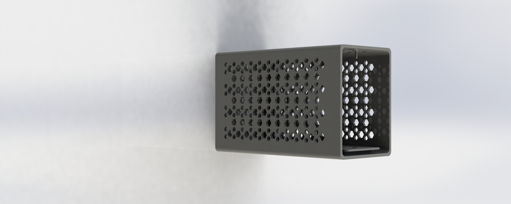

# Razer-Core-Case
### Introduction
* Razer core X is all good, except one thing: It is so freakin heavy (6.48 kg / 14.29 lbs without GPU I mean WTF).
* I want a good eGPU that I can take around with me, so I decided to model the exterior of Razer Core X and then add a bunch of honeycomb holes, finally print it out using PLA plastic so it will be much lighter then the original enclosure.
* Also can be used for other TB3 eGPU boards in the future...It's a good case design.
* 

### File System
* [Model] Contains the .SLDPRT and .SLDASM Model file for Solidworks.
* [Iteration] Contains iterations I made for the models.
* [STL] Contains .STL geometry files for the newest iteration.
* [G-CODE] Contains the .GCODE and .FORM file for 3D printers.
   * .GCODE is for Raise 3D Dremel Ideamaker.
   * .FORM is for FORM2 Resin Printer.
